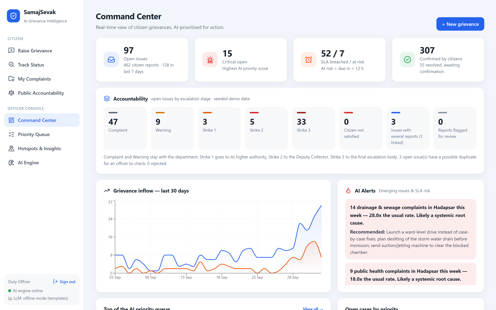
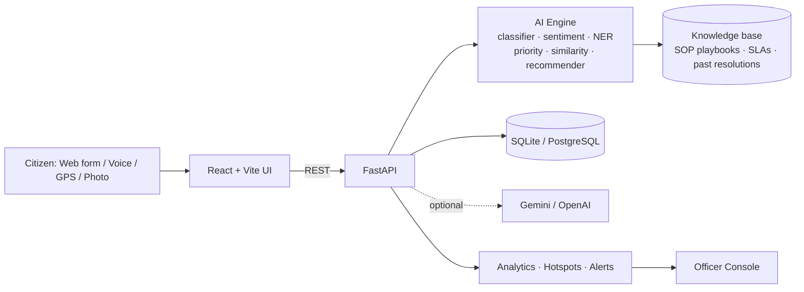

# SamajSevak — AI-Powered Public Grievance Intelligence Platform

> **Hack2Ignite · Problem Statement AI-04:** Design an AI-powered public grievance analysis and resolution recommendation platform.

SamajSevak turns raw citizen complaints (English, Hindi, Marathi and Roman-script Hinglish; web form today, with WhatsApp / call-centre intake on the roadmap) into **prioritised, routed and actionable cases** — and tells officers *how* to resolve them, based on SOPs and what worked for similar past cases.



## ✨ Key features

| For citizens | For officers / administrators |
|---|---|
| Raise grievance in free text or **voice**, in **English / हिंदी / मराठी** | **Login-protected console** (salted password hash, signed 8 h token) |
| Attach a **photo** and a **GPS fix or map pin** | **Command Center**: KPIs, 30‑day trend, AI alerts |
| **Live AI preview** while typing (department, priority, ETA) | **Priority queue** ranked by explainable AI score |
| Tracking ID, status timeline, SLA | **Grievance detail** with AI triage, "why this priority", duplicates |
| Rate the resolution (feedback loop) | **Recommended resolution plan** + proven past actions + ETA |
| See the officer's **photo proof** of the fix | **Confirm / correct the AI category** → becomes training data, one-click retrain |
| | **AI-drafted citizen reply** (Gemini/OpenAI, offline template fallback) |
| | **Hotspot map**, ward risk ranking, department SLA performance |
| | **Emerging-issue detection** (spike vs baseline → root-cause alert) |

## 🧭 Accountability workflow (v1.2)

**One real-world problem = one master issue, however many citizens report it.**

1. **Before submitting**, the citizen is shown open issues that look like theirs (title, status, tracking ID, distance, number of reports — nothing about other citizens) and can **join** one. That link is recorded as `CITIZEN` and the AI makes no merge decision for that report.
2. **If they do not join**, the report is filed and the AI checks it against open issues. It links the report (`AI`) only on a combination of evidence: both have GPS, within 300 m, and the wording or the photo matches; or, without GPS, same ward plus a strong wording match and the same landmark, or a matching photo. Same ward, same category or same keyword alone never merges. Otherwise the report becomes a new master issue.
3. **Officers** see one row per master issue with every report under it, the evidence for each link, and can confirm, detach or re-link a report (`OFFICER`). Reports are never deleted or overwritten.
4. **Photo reuse**: SHA-256 for identical files and a 64-bit difference hash for re-saved copies. It compares pictures; it does not understand them.
5. **Citizen verification**: *Resolved* means "awaiting citizen confirmation". *Satisfied* closes the issue; *Not satisfied* reopens it for everyone on it; no answer is never treated as satisfied.
6. **Five-stage escalation** of an unresolved master issue:

| Stage | Held by |
|---|---|
| Complaint | Concerned department |
| Warning | Concerned department (a warning never leaves the department) |
| Strike 1 | Higher authority of the concerned department |
| Strike 2 | Deputy Collector |
| Strike 3 | Final escalation body: IAS officers and opposition party leaders |

   A strike marks how long an issue has gone unresolved; it is not a score of any officer, department, government or party. **This ladder is the prototype's own design, not a verified legal or government procedure, and the durations are placeholders**: by default the Complaint period is the category's SLA and each later stage lasts half of it. Change them in `ESCALATION_STAGES` (`backend/app/knowledge.py`) or set `SAMAJSEVAK_STAGE_HOURS`. Escalation only changes the stage, the audit trail and what the screens show; no message is sent to any real authority.
7. **Citizen account and privacy**: name + mobile number is the login. Officers see an internal citizen ID (`CIT-00012`), never the name or the number. Abuse signals (reused photo on a different issue, bursts from one account or network, identical text) only raise a review flag, need two signals to do so, and never reject anything; the network address is stored as a salted hash for 30 days and is not shown to anyone.
8. **Public accountability page**: aggregate counts only (received, resolved, pending, by stage, by department and ward).

## 🧠 AI pipeline

> Full step-by-step walkthrough (input → output, and what happens behind the scenes at each step): **[docs/HOW_IT_WORKS.md](docs/HOW_IT_WORKS.md)**

1. **Detect language & clean** – English, Hinglish, Hindi, Marathi (other scripts are recognised and flagged); strip greetings/boilerplate.
2. **Classify & route** – average of two models: TF‑IDF (word 1–2 grams + char 3–5 grams) and multilingual sentence embeddings (`paraphrase-multilingual-MiniLM-L12-v2`, ONNX, CPU), each → Logistic Regression across 11 categories → department + SLA. Low confidence (<40%) → human triage.
3. **Entity extraction** – ward, landmark, duration, risk keywords, vulnerable groups, from English + Hindi + Marathi + Hinglish lexicons mapped to one vocabulary.
4. **Sentiment & distress** – lexicon + intensifiers + punctuation/caps signals.
5. **Duplicate detection** – embedding + TF‑IDF similarity (matches across languages), category-aware re-ranking, then **GPS distance**: an open same-category case within 300 m is the same incident, 2 km away in the same ward is not. Falls back to same-ward when a report has no GPS.
6. **Explainable priority (0–100)** – severity + risk terms + vulnerability + distress + duration + cluster size + repeat complaint; every point is shown to the officer.
7. **Resolution recommendation** – context-ranked SOP playbook + retrieval of what resolved similar cases + median historical resolution time → ETA + inter-department coordination.
8. **Emerging issue detection** – ward × category volume in last 7 days vs 3‑week baseline (≥2× and ≥4 cases) + SLA-breach escalation.
9. **GenAI assist (optional)** – LLM drafts empathetic, grounded replies and checks whether the attached photo shows the reported problem (advisory only). Without a key, replies use templates (English / Hindi / Marathi) and photos are for the officer to review.

Classifier accuracy (`backend/models/metrics.json`):

| Check | Result | How much to trust it |
|---|---|---|
| Synthetic test split (1,232 rows) | 99.5% | Not much: train and test rows come from the same templates |
| Hand-written development set (121 complaints) | 98.3% | Optimistic: templates were written with these in view |
| **Hand-written English + Hinglish final set (66 complaints, written after the templates were frozen)** | **87.9% (58/66)** | The number to quote. TF‑IDF alone scores 80.3% on it |
| Hindi, Devanagari (33 hand-written) | 100% · 90.9% zero-shot | Optimistic, see below. Zero-shot = before any Hindi training text existed |
| Marathi, Devanagari (33 hand-written) | 97.0% · 84.8% zero-shot | Same |
| Probe, no training text at all: Gujarati / Bengali / Tamil (11 each) | 10 / 9 / 9 of 11 | Tiny sample; these languages always go to human review |

On the final set 55 of 66 complaints passed the 40% confidence gate and 4 of those were routed to the wrong department; the rest went to human triage. The Hindi and Marathi sets were written before their training templates, but by the same author and the templates are translations of the English ones, so they are optimistic in the way the development set is; the zero-shot figures are the cleaner ones.

**Training data.** The base is still synthetic templates (English, Hinglish, Hindi, Marathi). What is new is the path away from that: when an officer confirms or corrects a category in the console, the complaint is stored as a verified label, and *Retrain* (AI Engine page, or `python -m app.ml.train`) trains on templates + verified complaints (weighted 10×) and hot-swaps the model. No real citizen data has been collected yet, so no accuracy on real complaints is claimed.

**Languages, honestly.** Full pipeline (classifier, risk keywords, duration, ward, reply) for English, Hinglish, Hindi and Marathi. Any other language is detected by script, gets a category suggestion from the embeddings, and is always sent to human review because the risk lexicon cannot read it. Roman-script Marathi is not handled.

## 🏗 Architecture



## 🛠 Tech stack
- **Frontend:** React 19, Vite, React Router, Recharts, Leaflet (OpenStreetMap), lucide-react
- **Backend:** Python 3.11, FastAPI, Uvicorn, SQLite
- **ML/NLP:** scikit-learn (TF‑IDF, Logistic Regression, cosine similarity), fastembed + ONNX Runtime (multilingual MiniLM sentence embeddings, no PyTorch), NumPy, joblib
- **Auth:** PBKDF2‑SHA256 password hashes, HMAC‑signed bearer tokens (standard library)
- **GenAI (optional):** Google Gemini 2.0 Flash / OpenAI GPT-4o-mini via httpx
- **DevOps:** Docker (single container), pytest

## 🚀 Run locally

**Backend** (Python 3.10+):
```bash
cd backend
python -m venv .venv
# Windows: .venv\Scripts\activate   |  macOS/Linux: source .venv/bin/activate
pip install -r requirements.txt
python -m app.ml.train          # optional, a trained model is already included
uvicorn app.main:app --reload --port 8000
```
The first start seeds ~460 realistic historical grievances (with simulated GPS points and a few Hindi / Marathi cases) and downloads the embedding model once (~240 MB; set `SAMAJSEVAK_EMBEDDINGS=0` to skip it and run TF‑IDF only). API docs: http://localhost:8000/docs

**Officer login:** set `OFFICER_USER` / `OFFICER_PASSWORD` (see `.env.example`). With no password set, a demo account is created and shown on the login page — fine for a demo, not for a real deployment.

**Frontend** (Node 18+), in a second terminal:
```bash
cd frontend
npm install
npm run dev        # http://localhost:5173 (proxies /api to :8000)
```

**Single command (Docker):**
```bash
docker build -t samajsevak . && docker run -p 8000:8000 samajsevak   # http://localhost:8000
```

**Optional LLM:** set `GEMINI_API_KEY` or `OPENAI_API_KEY` before starting the backend (reply drafting + photo check).

**Tests:** `cd backend && pytest -q`

## 📡 API
| Method | Endpoint | Purpose |
|---|---|---|
| POST | `/api/analyze` | Public. Live AI analysis (no save) + `existing_issues` the citizen could join |
| POST | `/api/grievances` | Public. File a report: text + optional `lat`/`lng`, `photo`, `citizen_category`, `join_issue` |
| POST | `/api/citizen/login` | Citizen sign-in with name + mobile (creates the account on first use) |
| GET | `/api/citizen/grievances` | Citizen. Own reports only |
| GET | `/api/track/{id}` | Public. Status, stage, authority, timeline — no name, phone, coordinates or AI internals |
| GET | `/api/public/stats` | Public. Aggregate counts |
| GET | `/api/track/{id}/resolution-photo` | Public. Officer's photo proof |
| POST | `/api/grievances/{id}/feedback` | The report's own citizen: satisfied / not satisfied, rating, comment (once resolved) |
| POST | `/api/auth/login` | Officer sign-in → bearer token |
| GET | `/api/grievances` | Officer. Filterable priority queue |
| GET | `/api/grievances/{id}` · `/photo` | Officer. Detail, AI analysis, timeline, evidence photo |
| PATCH | `/api/grievances/{id}` | Officer. Assign / update status / resolve (+ proof photo) / confirm or correct category / link or detach a report (`master_id`) |
| POST | `/api/grievances/{id}/draft` | Officer. AI citizen reply |
| GET · POST | `/api/model` · `/api/model/retrain` | Officer. Verified-label count · retrain and hot-swap the classifier |
| GET | `/api/stats` · `/api/analytics` · `/api/hotspots` · `/api/alerts` | Officer. Dashboards & insights |

Officer endpoints return 401 without a valid bearer token.

## 🗺 Roadmap
More Indian languages with their own risk lexicons (or an IndicBERT/MuRIL model) · offline image model for photo evidence (today it needs an LLM key) · WhatsApp bot · per-officer accounts and roles for each escalation authority, real notifications on escalation, OTP verification for citizens, non-guessable tracking IDs · real complaint data via the officer-verification loop · PostgreSQL + PostGIS · CPGRAMS/municipal system integration.

## 📁 Structure
```
backend/app/        FastAPI app, auth, services, knowledge base + lexicons, language detection, geo, LLM helper
backend/app/ml/     dataset generator, evaluation sets, embeddings, training, AI engine
backend/models/     trained classifier + metrics
frontend/src/       React pages & components
docs/               presentation
```
